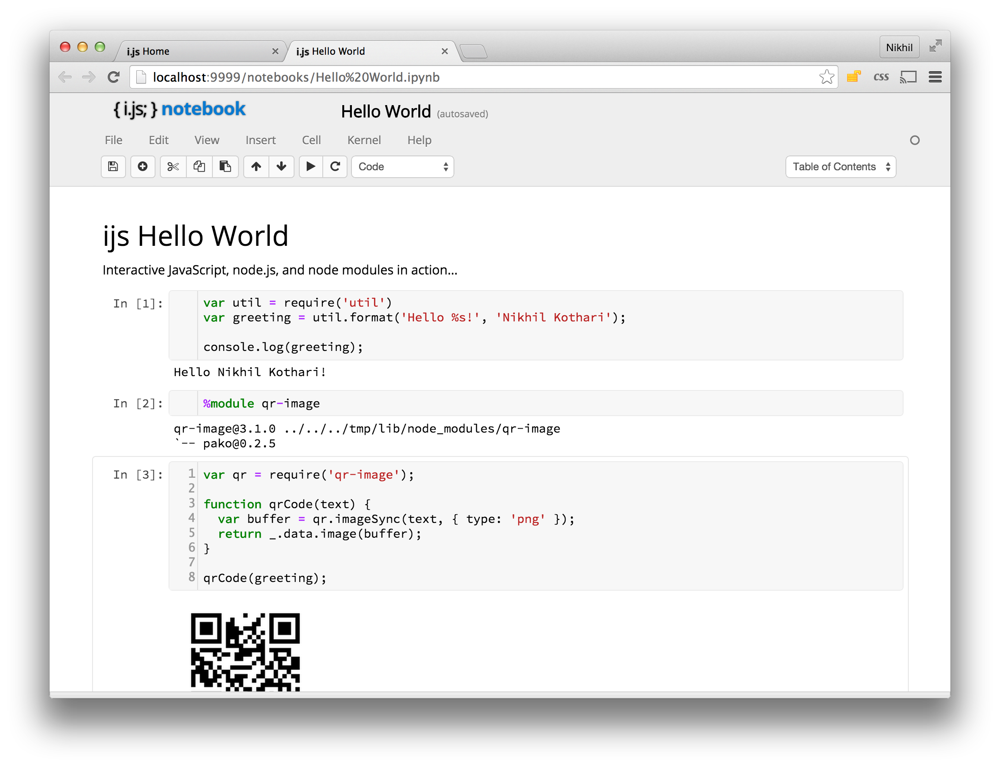
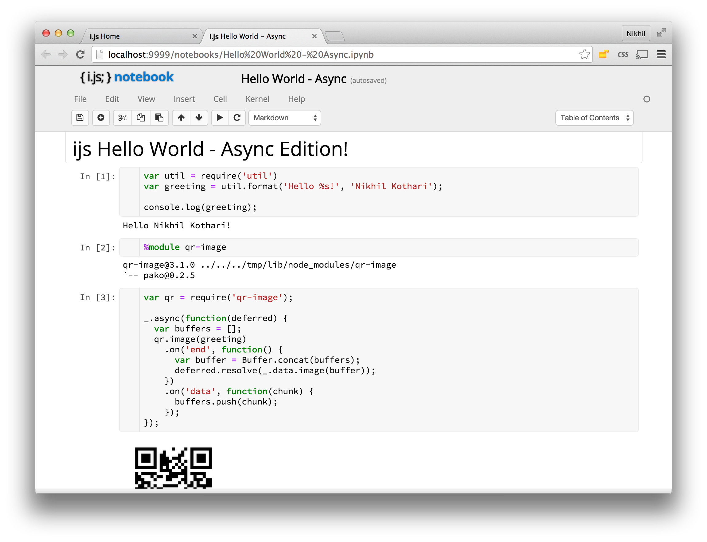
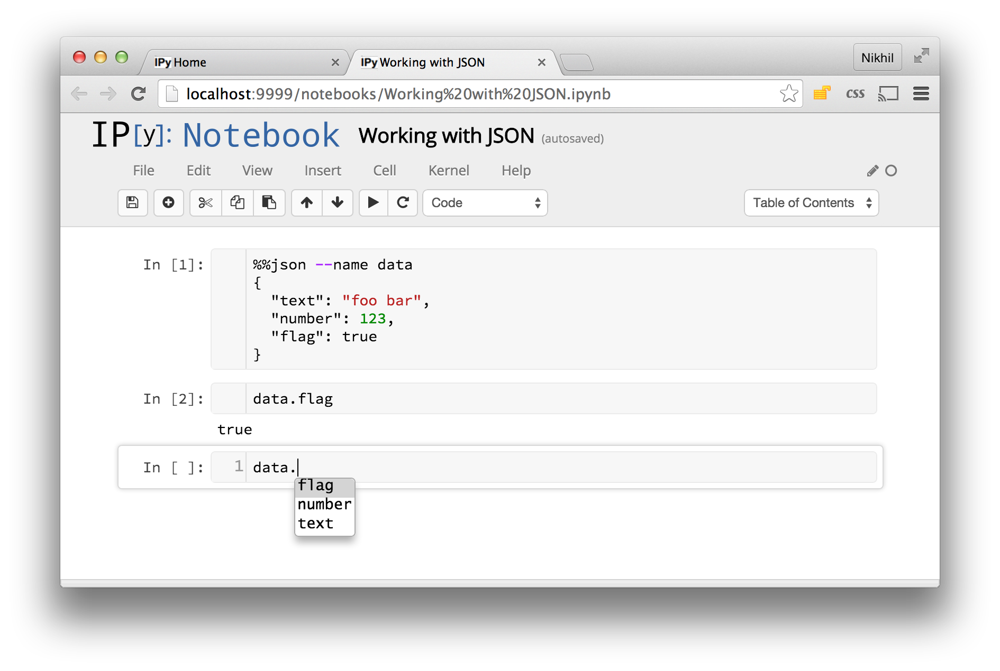
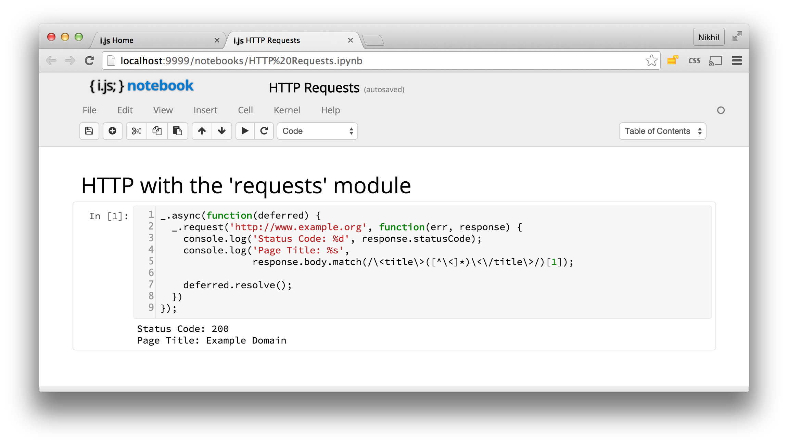
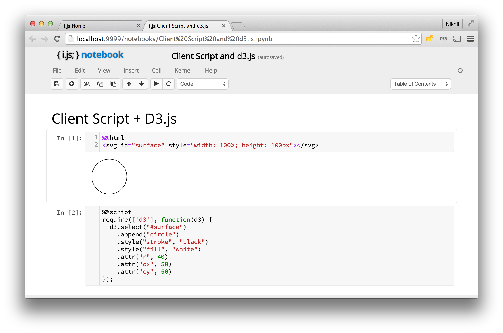

# ijs

An environment for interactive JavaScript authoring and execution built
on top of the IPython notebook metaphor.

An ijs notebook is powered by a javascript kernel written in node.js (and
replaces the standard python kernel). A kernel runs behind the scenes and
executes the code you write in notebooks. The notebook displays the outputs
generated by your code.

You can use node.js APIs, as well as the large library of node.js modules
in your notebooks. You can also author client-side HTML and JavaScript to
run code within the browser. JavaScript is truly universal!

## Getting Started
You can use ijs by installing it as a node module, or via a pre-packaged
docker container.

### Local Installation
You can install the `ijs` node module globally and start the notebook
environment using the `ijs` command.

    sudo npm install -g ijs
    ijs <path to working directory>

Then browse to http://localhost:9999.

The tool will create a `notebooks` directory within the specified working
directory.

Note: If you don't already have node.js and IPython installed, you'll need
to do so first. Unfortunately setting these up can be a bit involved. Here
are the instructions to do so, if you don't already have them.

### Docker
This avoids the need to go through the steps of getting a local setup. As
long as you've got a working docker setup (using boot2docker on a mac),
you're good to go. Just issue the following commands:

    docker pull nikhilk/ijs
    docker run -i -p 9999:9999 -v <path to working directory>:/data -t nikhilk/ijs
    
And then browse to http://localhost:9999 and you're on your way.

## Screenshots

### Authoring Async Code
Lots of node.js APIs are async, and you can write async code in notebook
cells too!

### Working with JSON
JSON is everywhere, and you can use a `%%json` cell to easily declare
JSON data. The notebook provides auto-complete functionality which extends
to this JSON data.

### HTTP requests
You can use the notebook interface to experiment with HTTP APIs using the
HTTP client provided by `request` node module.

### Client-script
You can easily add HTML markup to your notebook using an `%%html` cell
and client-script using a `%%script` block to use a variety of javascript
libraries such as d3.js.

